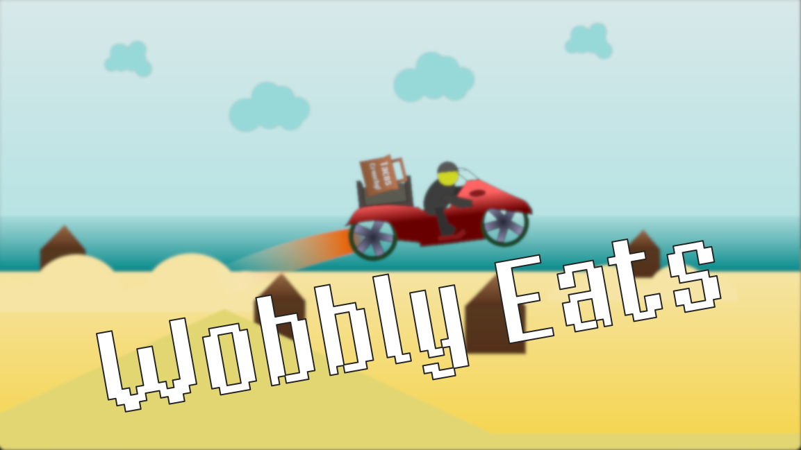

# Wobbly Eats - Ludum Dare 53

|             |                                                                                |
|-------------|--------------------------------------------------------------------------------|
| **Theme**   | _Delivery_                                                                     |
| **Date**    | _April 2023_                                                                   |
| **Type**    | _Compo_                                                                        |
| **Concept** | _Deliver meals with your bike without dropping the package!_                   |

**:rocket: [Play it here!](https://srynetix.github.io/wobbly-eats/)**

Welcome on my 7th **Ludum Dare** Compo entry!

Now that's a fun theme! And once again I choose something "food related" (see my previous game [Type-Eat]).

So I wanted to challenge **[Godot Engine 4.0.2]** (being used to the version *3*), and that was **really great**! (*very good job Godot guys*!)  
GDScript is **more powerful**, most of the problems I had in the past with the language are no more, and I only scratched the surface of the new things!  
For the drawing, I wanted to use [Inkscape] for once, and I'm really not disappointed. It's super useful, and even with my bad drawings, the result is quite nice!

So it's a **driving game** (or more exactly a **quirky physics-based 2D driving game**), where you have to deliver a food package to customers, but with sand dunes all over the place, so don't drop the food (you would not like it either if the delivery guy dropped your food).

The game got *10 levels*, each with time trials to beat.  
So try to be **the best**! :sunglasses:

**Software used**:
- [Godot Engine 4.0.2] with my [sxgd](https://github.com/Srynetix/sxgd) plugin collection,
- [Inkscape],
- [FL Studio](https://www.image-line.com/fl-studio/)

**Assets used**:
- The [VTF Mister Pixel font](https://velvetyne.fr/fonts/mr-pixel/)
- Some [FontAwesome icons](https://fontawesome.com/)

_Good luck, and have fun! (I did have fun making and playing this game!)_

## Preview

[Type-Eat]: https://github.com/Srynetix/type-eat/
[Godot Engine 4.0.2]: https://godotengine.org/
[Inkscape]: https://inkscape.org/
